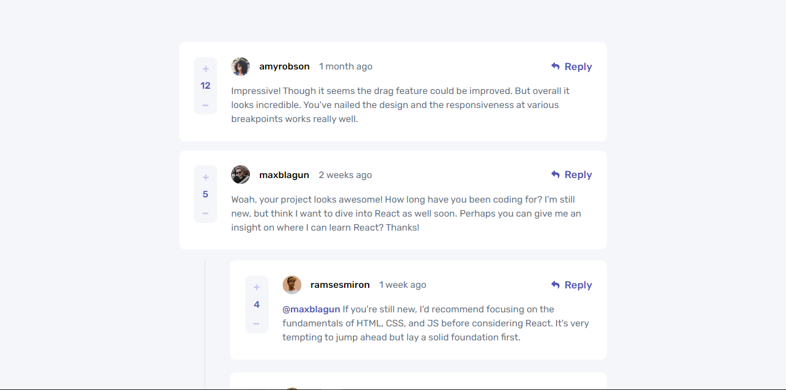

# Frontend Mentor - Interactive Comments solution

This is a solution to the [Interactive comment section challenge on Frontend Mentor](https://www.frontendmentor.io/challenges/interactive-comments-section-iG1RugEG9). Frontend Mentor challenges help you improve your coding skills by building realistic projects. 

## Table of contents

- [Screenshot](#screenshot)
- [Built with](#built-with)
- [Author](#author)

### Screenshot

### Built with

- Semantic HTML5 markup
- SASS
- Grid
- Flexbox
- React

## Author

- Frontend Mentor - [@veD-tnayrB](https://www.frontendmentor.io/profile/veD-tnayrB)
- Twitter - [@BryantDev_](https://www.twitter.com/BryantDev_)
